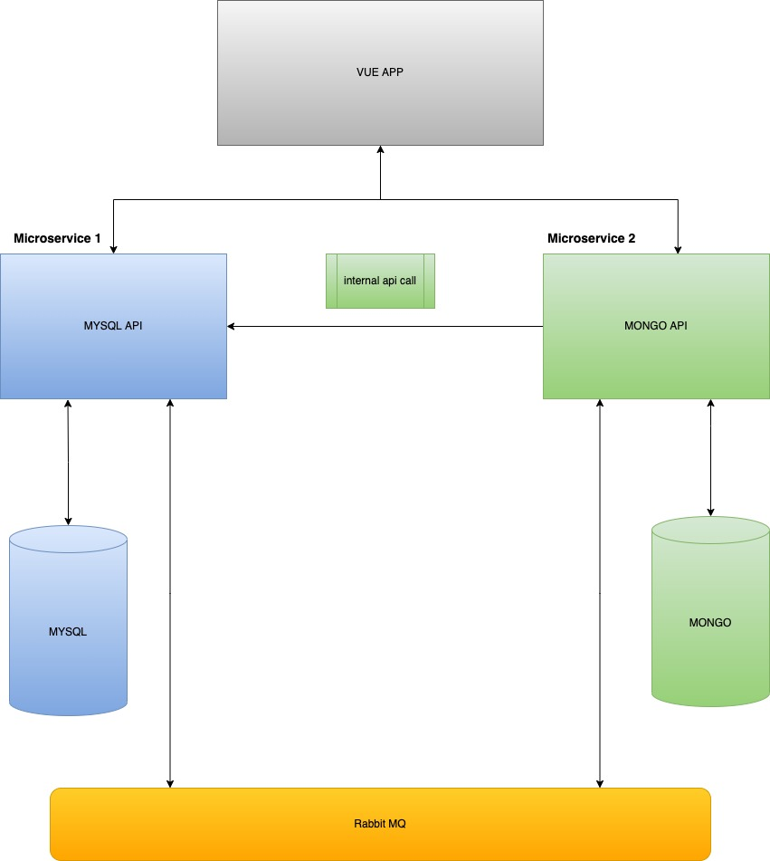

  

[circleci-image]: https://img.shields.io/circleci/build/github/nestjs/nest/master?token=abc123def456
[circleci-url]: https://circleci.com/gh/nestjs/nest

  
A progressive <a href="http://nodejs.org" target="_blank">Node.js</a> framework for building efficient and scalable server-side applications.

    

    
# Admin Microservice 1

This services interacts with rabbitMQ and a MYSQL DB. Its purpose is to store products and receive an api request from a separate Microservice. See Diagram below for visual representation.

